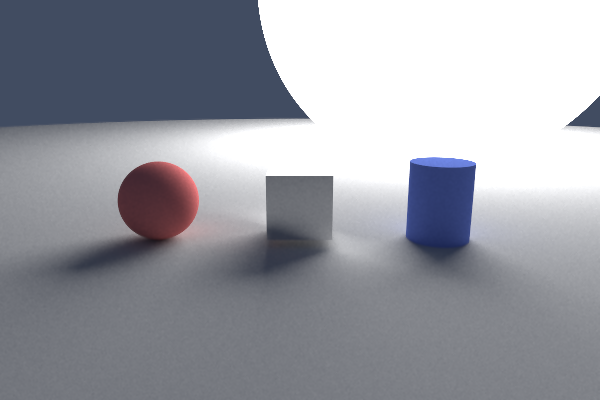

# rt — Monte Carlo Ray Tracer

A physically based path tracer written from scratch in Rust, with a real-time GUI built
with [egui](https://github.com/emilk/egui).



---

## Features

- **Path tracing** — physically correct light transport with recursive ray bouncing
- **Materials** — diffuse (Lambertian), reflective (with adjustable fuzz), emissive (light sources)
- **Geometry** — sphere, cube, cylinder, circular plane
- **BVH acceleration** — bounding volume hierarchy for O(log n) ray intersection
- **Bilateral denoiser** — edge-preserving noise reduction applied after rendering
- **Output** — writes both PNG and PPM on every render
- **GUI** — egui scene editor with camera controls, per-object configuration, and a live progress bar
- **Headless mode** — render from the command line without launching the GUI

---

## System Requirements

- Linux or macOS
- Rust 1.80 or newer

---

## Installation

### 1. Install Rust

```bash
curl --proto '=https' --tlsv1.2 -sSf https://sh.rustup.rs | sh
source $HOME/.cargo/env
```

### 2. Clone the repository

```bash
git clone https://github.com/yourusername/raytracer.git
cd raytracer
```

### 3. Build and run

```bash
cargo run --release
```

---

## Usage

### GUI mode (default)

```bash
cargo run --release
```

The GUI opens with a default scene already loaded. Use the left panel to configure the
scene, then press **Render**. The result appears in the viewport when complete and is
written to `output.png` and `output.ppm` in the project root.

### Headless mode

```bash
cargo run --release -- --no-gui
```

Renders the hardcoded scene in `main.rs` and writes `output.png` and `output.ppm` directly.

---

## GUI Reference

### Camera

| Control | Description |
|---|---|
| Position X/Y/Z | Camera location in world space |
| Look at X/Y/Z | Point the camera aims at |
| FOV | Field of view in degrees |

### Render settings

| Control | Description |
|---|---|
| Width / Height | Output resolution in pixels |
| Samples | Rays per pixel — more samples = less noise, longer render |
| Depth | Maximum ray bounces — higher values improve indirect lighting |

### Objects

Each object has:
- **Type** — Sphere, Cube, Cylinder, or Plane
- **Position** — X/Y/Z in world space
- **Size** — radius for sphere/cylinder/plane, side length for cube
- **Height** — cylinder only
- **Material** — Diffuse, Reflective, or Emissive
- **Color** — picked with a color chooser
- **Fuzz** — reflective only, 0.0 = perfect mirror, 1.0 = very rough
- **Strength** — emissive only, controls brightness of the light source

---

## Materials

### Diffuse
Scatters light in random directions across the hemisphere. The surface color attenuates
each bounce. Use for walls, floors, and non-shiny objects.

### Reflective
Reflects incoming rays around the surface normal. The `fuzz` parameter adds randomness
to the reflected direction — at 0.0 the surface is a perfect mirror, at 1.0 reflections
are almost fully diffused.

### Emissive
Does not scatter incoming light. Instead it emits light of a given color and strength.
Use for light sources — a large, low-strength emissive sphere produces soft area lighting,
a small high-strength one produces a point-like source.

---

## Architecture

```
src/
  renderer/         # Pure computation — no GUI dependencies
    color.rs        # Linear color model (0.0–1.0), gamma correction
    ray.rs          # Ray type and hit record
    camera.rs       # Camera, render loop, denoiser, PPM/PNG output
    scene.rs        # Scene container, BVH-accelerated trace loop
    bvh.rs          # Bounding volume hierarchy
  objects/
    mod.rs          # Hittable trait, HitRecord, AABB
    sphere.rs
    cube.rs
    cylinder.rs
    plane.rs
  materials/
    mod.rs          # Material trait, Scatter struct
    diffuse.rs
    reflective.rs
    emissive.rs
  gui/
    mod.rs
    app.rs          # egui application — scene editor, threaded render, progress bar
  lib.rs
  main.rs
```

The renderer and GUI communicate through a clean boundary — the GUI constructs a `Scene`,
calls `camera.render()` on a background thread, and receives the pixel buffer via a channel
when complete.

---

## How It Works

### Path tracing

A camera fires one or more rays through each pixel. Each ray bounces around the scene
until it either hits a light source or exhausts its bounce budget (`depth`). The color
accumulated along the path is averaged across all samples for that pixel.

At each surface hit the material decides what happens next:
- **Diffuse** — scatters the ray in a random hemisphere direction, attenuates by surface color
- **Reflective** — reflects the ray around the surface normal, with optional fuzz
- **Emissive** — terminates the path and contributes light directly

### BVH

Objects are organised into a binary tree of axis-aligned bounding boxes. When a ray is
tested against the scene, if it misses a node's bounding box the entire subtree beneath
that node is skipped. This reduces intersection testing from O(n) to O(log n) per ray.
The tree is built once after all objects are added and reused for every ray.

### Denoiser

After rendering a bilateral filter is applied. It averages neighbouring pixels but weights
each neighbour by spatial distance and color similarity — nearby pixels with similar colors
are blended freely while pixels across a sharp edge are left separate. This removes Monte
Carlo noise in flat regions without blurring object boundaries.

---

## Render Quality Guide

| Samples | Depth | Quality | Use case |
|---|---|---|---|
| 8–32 | 8 | Very noisy | Quick composition check |
| 64–128 | 16 | Acceptable | Scene development |
| 256–512 | 32 | Good | Review lighting |
| 1024–4096 | 32 | Clean | Final output |

Noise halves roughly every time samples are quadrupled — this is the nature of Monte Carlo
integration. The denoiser compensates significantly at lower sample counts.

---

## Dependencies

| Crate | Purpose |
|---|---|
| `nalgebra` | 3D vector math |
| `rayon` | Data-parallel rendering across all CPU cores |
| `rand` | Monte Carlo sampling |
| `egui` / `eframe` | Immediate-mode GUI |
| `image` | PNG output |

---

## Running Tests

```bash
cargo test
```

17 unit tests covering the color model, BVH traversal, and all four geometry types.

---

## License

MIT
